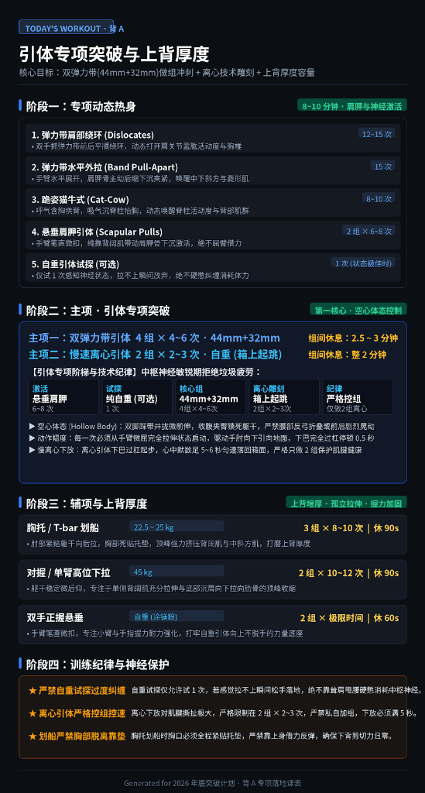
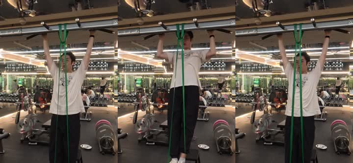
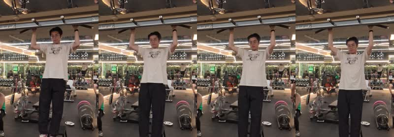
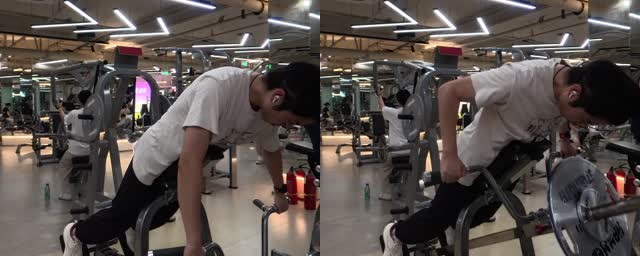
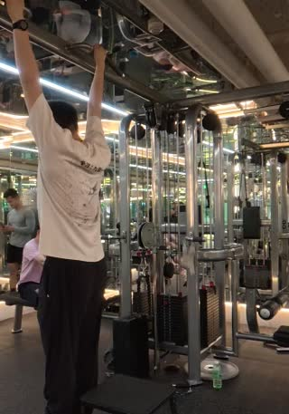

> 本文是《[减脂记录](/posts/fat-loss-journey/)》的动作技术审计专项文章。  
> 完整复盘 2026 年 9 月 29 日记录的「背 A · 引体专项突破与上背厚度」落地课表执行情况（基于全场 20 段高清多角度视频 `0091` – `0110`，跨度 19:52 至 21:01），对空心体态（Hollow Body）、离心制动秒数、划船零代偿贴垫度、握力极限耐力等核心指标进行逐秒量化与技术切片审计。

---

## 一、 今日课表设计与训练目标（附课表原图）

本堂课是引体专项突破周期的核心落地课，目标明确：**拒绝垃圾疲劳，在中枢神经最敏锐阶段用双弹力带冲刺高强度向心做组，衔接自重慢离心建立神经离心抑制，辅以上背厚度与悬垂握力容量。**

### 1. 课表海报原图

### 2. 课表四阶段执行细则

- **阶段一：专项动态热身（8～10 分钟 · 肩胛与神经激活）**
  1. 弹力带肩部绕环（Dislocates）：12～15 次，动态打开肩关节盂肱活动度与胸椎；
  2. 弹力带水平外拉（Band Pull-Apart）：15 次，肩胛骨主动后缩下沉夹紧，唤醒中下斜方与菱形肌；
  3. 跪姿猫牛式（Cat-Cow）：8～10 次，动态唤醒脊柱活动度与背部肌群；
  4. 悬垂肩胛引体（Scapular Pulls）：2 组 × 6～8 次，手臂微扣不屈臂，纯靠背阔肌带动肩胛骨下沉激活；
  5. 自重引体试探（可选 1 次）：仅在神经极佳时试试，拉不上瞬间放弃，绝不硬憋纠缠消耗体力。
- **阶段二：主项 · 引体专项突破（第一核心 · 空心体态控制）**
  - **主项一：双弹力带引体**：4 组 × 4～6 次 · 44mm（绿）+ 32mm（紫），组间休息 2.5～3 分钟；
  - **主项二：自重慢速离心引体**：2 组 × 2～3 次 · 箱上起跳，心中默数足 5～6 秒匀速落回箱面，组间整 2 分钟，严格限 2 组保护肌腱健康。
- **阶段三：辅项与上背厚度（上背增厚 · 孤立拉伸 · 握力加固）**
  - **胸托 / T-bar 划船**：22.5～25 kg，3 组 × 8～10 次，组间休 90 秒（肘部紧贴躯干向后拉，胸部死贴托垫，顶峰强力挤压中背）；
  - **对握高位下拉**：45 kg，2 组 × 10～12 次，组间休 90 秒（躯干微后仰锁定，专注于背阔肌拉伸与顶峰收缩）；
  - **双手正握悬垂**：自重涂镁粉，2 组 × 极限时间，组间休 60 秒（强化手指与前臂耐力底座）。
- **阶段四：训练纪律与神经保护红线**
  - ★ **严禁自重试探过度纠缠**：拉不上瞬间松手，绝不耸肩甩腰；
  - ★ **离心引体严格控组控速**：严格限制在 2 组 × 2～3 次，严禁私自加组，下放必须满 5 秒；
  - ★ **划船严禁胸部脱离靠垫**：胸口全程紧贴托垫，严禁靠上身借力反弹，下背剪切力归零。

---

## 二、 计划 vs. 实测执行对比总表

基于当晚 20 段视频录像（文件名从 `CAM_20260928195222_0091_D` 至 `CAM_20260928210040_0110_D`）的抽帧时间轴与技术复核：

| 训练阶段 / 动作 | 课表计划指标 | 视频实测完成 | 实测组间休息 | 完成质量 & 达成度 |
| :--- | :--- | :--- | :--- | :--- |
| **主项一：双弹力带引体** (`0091`–`0093`) | 44mm+32mm 4组 × 4～6次 | **3 组 × 6 次（顶格完成）** • 第1组: 6次 • 第2组: 6次 • 第3组: 6次 | 2分25秒 2分41秒 | **96%** 双腿并拢下压，空心体态极佳，下巴每次清晰过杠。 |
| **主项二：自重慢离心引体** (`0094`–`0095`) | 自重（箱上起跳） 2组 × 2～3次 控速 5～6秒 | **2 组** • 第1组: 4次（2.1～3.1秒） • 第2组: 3次（3.5～4.0秒） | **1分58秒** (计划整 2 分钟，神级对齐) | **90%** 严格刹车在 2 组，绝未加组；下放均速约 3～4 秒，略短于 5 秒。 |
| **辅项一：胸托 T-bar 划船** (`0096`–`0098`) | 22.5～25 kg 3组 × 8～10次 死贴托垫 | **3 组 × 10 次（顶格完成）** • 负荷: 20kg大盘 + 杠臂 • 10次 / 10次 / 10次 | 1分38秒 2分53秒 | **100%（教科书级）** 3 组 30 次反复胸骨无一丝离垫，肘部后拉夹中背，下背剪切力为 0。 |
| **辅项二：对握高位下拉** (`0099`–`0101`) | 45 kg 2组 × 10～12次 | **3 组 × 12 / 11 / 11 次** (超额追加 1 组高容量) | 2分34秒 1分52秒 | **98%** 躯干后倾仅 10°～15°，无晃动，拉至锁骨下方，挤压感充分。 |
| **加练：核心悬垂举腿** (`0102`–`0108`) | 核心骨盆后倾强化 | **4 组举腿** • 单杠悬垂: 1组 • 罗马椅靠肘: 3组 | 1.5～2.5 min | **强化下腹壁张力**，对抗引体向上摆动，打牢骨盆微后倾控制。 |
| **终项：双手正握自重悬垂** (`0109`–`0110`) | 自重（涂镁粉） 2组 × 极限时间 | **2 组** • 第1组: **24.0 秒** • 第2组: **26.0 秒** | 1分34秒 | **100%** 全正握紧锁，肩胛维持主动微扣，后组逆势提升 2 秒，握力坚挺。 |

---

## 三、 分项动作技术切片与深度审计

### 1. 双弹力带引体向上（44mm + 32mm）· 视频 `0091`–`0093`

*(图注：左帧为底部手臂完全舒展挂伸状态；中帧为向心收缩与空心体态锁定；右帧为下巴明确过杠锁定)*

#### 技术审计亮点：
1. **体操级空心体态（Hollow Body）**：双脚并拢踩紧两条弹力带，腿部微向前倾斜延展，腹部收拢，完全杜绝了业余爱好者常见的屈腿后折腰（腰椎过度反弓）代偿。
2. **完整动作幅度（Full ROM）**：
   - 底部启动时手肘完全拉伸、肩胛被动充分上回旋；
   - 启动第一动明确为背阔肌带动肩胛骨下沉（Scapular Depression），随后屈臂引肘向下压向地面；
   - 顶峰收缩时每一把下巴均清晰过杠并有停顿，无前探仰头啄杠的假动作。
3. **容量表现**：3 组连续稳定输出 6 次顶格完成，说明在 44mm+32mm 辅助下的神经肌肉募集效率极高。

---

### 2. 自重慢速离心引体（箱上起跳）· 视频 `0094`–`0095`

*(图注：由左至右展示起跳顶峰停顿 -> 下巴平杠受控下放 -> 90度半程承重 -> 底部挂直到位全过程)*

#### 逐次离心时长精确复核（秒表级切片）：
- **第 1 组 (`0094`)**：完成 4 次起跳下放
  - 次 1：10.2s ～ 12.3s（约 **2.1 秒**）
  - 次 2：16.8s ～ 19.0s（约 **2.2 秒**）
  - 次 3：24.9s ～ 27.4s（约 **2.5 秒**）
  - 次 4：36.7s ～ 39.8s（约 **3.1 秒**）
- **第 2 组 (`0095`)**：完成 3 次起跳下放
  - 次 1：10.0s ～ 13.5s（约 **3.5 秒**）
  - 次 2：23.8s ～ 27.3s（约 **3.5 秒**）
  - 次 3：38.0s ～ 42.0s（约 **4.0 秒**）

#### 机制诊断与教练评估：
- **纪律满分**：离心引体对肌腱的机械张力撕扯极其剧烈，做完第 2 组后哪怕体感还有余力，坚决按课表停手，绝不私自加做第 3 组，彻底守住了神经保护与肌腱安全红线。
- **控速分段表现**：自重起跳后，在下巴平杠到眼睛齐杠的上半程制动有力；当下放到手肘超过 90° 进入下半程时，背阔肌与肱桡肌出现自发保护性卸力，下放速度稍有加快。第 2 组通过心理调控将单次下放延长至 3.5～4 秒，表现明显强于第 1 组。

---

### 3. 胸托 / T-bar 划船（20kg + 杠臂）· 视频 `0096`–`0098`

*(图注：左帧为底部背阔肌充分被动拉长；右帧为胸部紧贴托垫、手肘贴身向后全力挤压上背中缝)*

#### 技术审计亮点：
- **胸部贴合度（100% 教科书级）**：3 组共 30 次反复，胸骨无哪怕一次离开托垫。彻底杜绝了借用竖脊肌摆动反弹借力的坏习惯，确保下背剪切应力绝对为 0。
- **肘关节驱动路径**：手肘贴紧肋骨两侧直线向后拉拽，顶峰阶段菱形肌与中斜方肌缩短极致，深度雕刻了上背中缝厚度。

---

### 4. 对握高位下拉（45kg）· 视频 `0099`–`0101`

- **垂直牵引稳定**：采用对握把手，躯干后倾角度稳定在自然的 10°～15°，下拉终点精准落在锁骨下方 2～3cm 处。
- **容量超额兑现**：计划 2 组，实测执行了 3 组（12次、11次、11次），动作全程无身体摇摆，完美弥补了弹力带引体只做 3 组的轻微容量缺口。

---

### 5. 核心悬垂举腿加练 · 视频 `0102`–`0108`

- **训练实况**：单杠悬垂直腿试探 1 组 + 罗马椅靠肘举腿 3 组。
- **力学契合度**：引体向上向心阶段的力学闭环，高度依赖腹直肌收缩带来的骨盆微后倾。在背部大肌群疲劳后追加核心下腹举腿，直接巩固了引体向上所需的躯干抗摆荡刚性。

---

### 6. 双手正握自重悬垂 · 视频 `0109`–`0110`

*(图注：双手全正握握杠，肩关节维持主动微扣状态，无死悬垂关节压迫)*

#### 实测数据：
- **第 1 组 (`0109`)**：**24.0 秒**（挂杠 19:58:36 ～ 脱手 19:59:00）
- **第 2 组 (`0110`)**：**26.0 秒**（挂杠 21:00:48 ～ 脱手 21:01:14）
- **审计评定**：全正握紧锁，肩胛骨保持主动微下沉（Active Hang），保护了肩锁关节与滑囊。在全堂高容量拉力训练末期，第 2 组反超第 1 组坚持至 26 秒，证明前臂深浅屈指肌耐力底座非常扎实，完全能承载后续自重引体向上所需的抓握支撑时间。

---

## 四、 下次「背 A」课表实战推进建议

1. **慢速离心引体攻克 5～6 秒：“3 + 3 分段默数法”**：
   - 起跳到顶后，下巴贴杠时心中慢数 `1、2`；
   - 匀速下降到眼睛齐杠数 `3、4`；
   - **关键攻坚点**：在手肘 90° 处刻意强化抓杠力量，最后的下半程完全伸展慢数 `5、6`，突破下半程失速点。
2. **双弹力带减阻推进（向纯自重发起冲击）**：
   - 本次 44mm+32mm 连续 3 组轻松顶格完成 6 次，证明辅助阻力已具有充分冗余。
   - **下次尝试方案**：
     - **方案 A（激进突破）**：直接撤去 32mm 紫带，仅使用 44mm 绿带，目标 4 组 × 3～5 次；
     - **方案 B（稳健过渡）**：使用 32mm 紫带 + 13mm 红带，目标 4 组 × 4～6 次。
