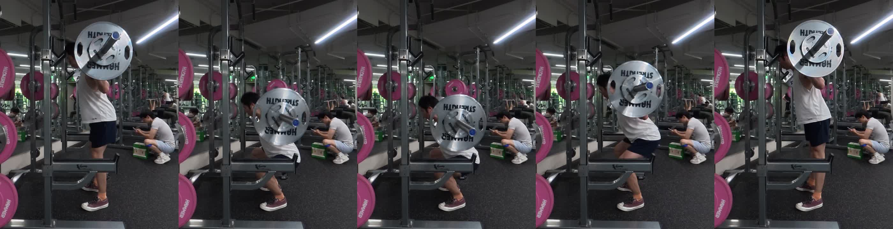
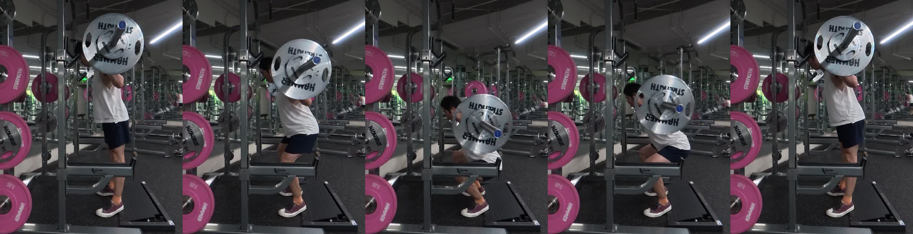
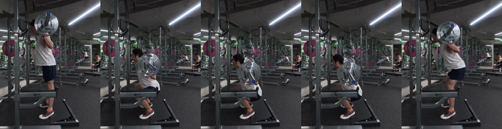

> 本文是《[减脂记录](/posts/fat-loss-journey/)》的动作技术审计专项文章。  
> 记录 2026 年 9 月 25 日腿 B（轻日）训练中，50 kg 暂停深蹲与 70 kg 常规深蹲的侧拍五帧动作结构，重点审计最后一组**完全脱离斜坡垫板（纯平地）**的力学表现。

---

## 一、审计背景与测试说明

在《[减脂记录](/posts/fat-loss-journey/)》与训练计划中，深蹲年底目标是 **100 kg 4×5 做组**。

此前为了保证下蹲深度并改善踝关节背屈受限，在深蹲时常态化使用了足跟斜坡垫板。2026-09-25 的腿 B 训练中，完成了 3 组 50 kg 暂停深蹲（停顿 2 秒）与 3 组 70 kg 常规深蹲。**在 70 kg 的最后一组（第 3 组），尝试完全撤除斜坡垫板，双脚穿平底鞋直接踩实地面完成 8 次深蹲**。

本篇审计提取侧面五帧（出杠、下放中段、最低点、起身中段、锁定），对**使用斜坡**与**脱离斜坡**的两份审计数据做完整保留与力学对照。

---

## 二、审计结论总评

**综合判定：全绿通过 (All Pass)**

1. **原生踝关节背屈达标**：脱离斜坡后，最低点髋折痕依然清晰低于膝关节上沿，满足标准力量举有效深度（白灯）。
2. **骨盆完全中立（Zero Butt Wink）**：平地极限深度下，下背与骶髂关节维持中立，完全无代偿性骨盆翻转（屁股眨眼）。
3. **足底完全抓地**：平底鞋后跟死死贴实地面，无脚后跟浮动或重心前倾。
4. **后链协同更佳**：平地深蹲躯干前倾顺应性增加约 5°，后链（臀大肌、腘绳肌）做工比例大幅提升，动力链传递更具功能性。

---

## 三、审计一：最后一组 70 kg（脱离斜坡 · 纯平地）侧面五帧详解

> 样本源：`CAM_20260925132525_0071_D.MP4`（组 3，第 8 次完成，平地鞋贴地）

### 1. 连续五帧全景对比

### 2. 五帧逐阶段指标评定

| 动作阶段 | 观察时间 | 核心力学指标 | 审计评定 | 说明 |
|---|:---:|---|:---:|---|
| **帧 1：出杠与起始锁定** | `00:22.8` | 接触面、站姿、瓦式加压 | **优秀** | 移除斜坡垫板，平底鞋直接贴合橡胶地面，三点均匀受力；中高杠落位紧凑，核心腹压饱满。 |
| **帧 2：离心下放中段** | `00:35.8` | 屈髋与胫骨倾角、力线 | **优秀** | 膝关节平顺前移，髋部顺势后折，躯干前倾约 42°～45°，杠铃垂直重心理线精确锁定在足中线正上方。 |
| **帧 3：最低点有效深度** | `00:36.6` | 髋折痕深度、骨盆反扣检测 | **优秀** | **关键硬指标**：股骨髋折痕明确低于髌骨最高点，腰椎维持自然中立，**零骨盆眨眼**，足跟无一丝起浮。 |
| **帧 4：向心中段推起** | `00:37.2` | 伸髋发力、胸髋同步率 | **优秀** | 出坑推起时胸部与髋部同步抬升，未出现先翘臀后起身的早安式代偿（Good Morning）。 |
| **帧 5：顶端锁定与呼吸** | `00:38.2` | 关节闭锁、呼吸重置 | **优秀** | 髋膝完全伸展，臀大肌收缩闭锁，无过度挺肚骨盆前倾，顶端稳定完成瓦式呼吸换气重置。 |

---

## 四、审计二：组 2 70 kg（使用斜坡垫板）侧面五帧对照

> 样本源：`CAM_20260925131716_0070_D.MP4`（组 2，第 8 次完成，足跟垫高）

### 1. 连续五帧全景对比

### 2. 斜坡模式力学特征

- **优势**：足跟垫高后人工补偿了踝关节背屈，膝关节前移距离更大，躯干更接近直立（前倾约 35°～38°），股四头肌力臂拉长，膝伸发力感更集中。
- **局限**：双脚处于向前的斜切面上，足底受力存在向前的分力；对后链伸髋肌群（臀大肌、腘绳肌）的负荷刺激相对低于平地深蹲。

---

## 五、动力学深度对比：斜坡垫板 vs 纯平地

| 对比维度 | 使用斜坡垫板（组 2） | 完全脱离斜坡（组 3） | 训练学与体能建议 |
|---|---|---|---|
| **踝关节背屈需求** | 外源性垫高代偿 | **100% 依赖原生背屈** | 证明原生背屈已完全合格，不需要器械代偿。 |
| **膝关节前移轨迹** | 膝关节显著前移过脚尖 | 膝关节微过脚尖即稳定 | 平地深蹲膝关节剪切力更小，对髌腱负荷更轻。 |
| **躯干倾角与脊柱** | 约 35°～38°（相对更直立） | **约 42°～45°（自然微前倾）** | 均为生理合理范围，平地模式脊柱维持绝对刚性。 |
| **发力肌群分配** | 股四头肌高度主导 | **股四头肌 + 臀大肌/腘绳肌均衡协同** | 平地深蹲能强化后链整体功能，增强复合力量。 |
| **骨盆眨眼（Butt Wink）** | 零眨眼 | **零眨眼** | 核心柔韧性指标：脱离斜坡依然完全不翻骨盆。 |
| **足底传力效率** | 脚底存在斜面下滑分力 | **垂直地面牢固抓地** | 平地地面垂直反作用力传递更干净。 |

---

## 六、50 kg 暂停深蹲专项审计（组 1）

- **实测停顿**：全部 5 次动作最低点均达成 **2.0～2.4 秒完全静止**。
- **消除牵张反射**：在底部彻底消除弹性能量储存后，完全依靠中枢神经募集与纯肌肉收缩向心启动，出坑力量干净利落，为组 3 脱离斜坡打下了坚实的技术底子。

---

## 七、后续训练推进建议

1. **全面转为纯平地深蹲**：
   鉴于纯平地状态下深度、骨盆中立度与力线全绿，后续常规深蹲（无论轻日还是重日）全面固定在平地上进行，不再依赖斜坡垫板。斜坡仅作为特定孤立刺激股四头肌时的辅助工具。
2. **重日负荷推进信心**：
   轻日最后一组平地即能完成 70 kg × 8，保守估算 1RM 已经达到 89～92 kg。重日下一跳直冲 **90 kg 4×5** 储备充分，年底 **100 kg 4×5** 目标进度大幅超前。
